# 地面站软件配置与使用

## 1. 环境配置
#### 1.1 安装VS community
- 建议使用2019版本；
- 选择安装QT相关内容；
- 在visual studio installer --“单个组件”页面中，勾选windows 10 SDK(10.0.18362.0)

#### 1.2 安装ros-melodic
- 解压解压ros-melodic-desktop_full202010.rar；
- 双击ros-melodic-desktop_full\tools\setup.exe，点击`install`，等待安装（默认路径安装在C盘，建议安装在C盘）；
- 在桌面通过右键，“新建快捷方式”，输入：
```libzmqlibzmq
C:\Windows\System32\cmd.exe /k "C:\Program Files (x86)\Microsoft Visual Studio\2019\Community\Common7\Tools\VsDevCmd.bat" -arch=amd64 -host_arch=amd64 && set ChocolateyInstall=c:\opt\chocolatey && c:\opt\ros\melodic\x64\setup.bat
```
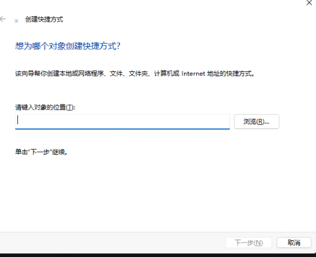

- 测试：双击生成的快捷方式，看roscore是否启动成功，成功启动效果如下图所示：
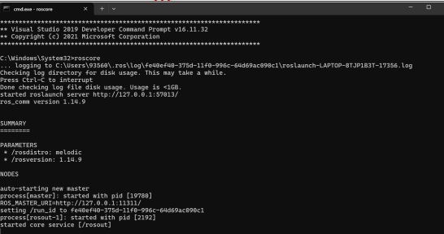

#### 1.3 依赖项
- 将文件zmqpp.7z解压得到文件夹zmqpp，并将此文件夹放置在`C:\opt\ros\melodic\x64\include`下(如ros没有安装在C盘，需要根据ros实际放置的路径进行修改）；
[点击此处下载 zmqpp.7z 文件](../assets/ground_station/zmqpp.7z)

- - 将文件夹libzmq.7z解压缩，将其中的文件`libsodium.dll`，`libzmq-v142-mt-4_3_4.dll`，`zmqpp.dll`，`zmqpp.lib`，`zmqpp-static.lib`放置在路径`C:\opt\ros\melodic\x64\lib下`（需要根据ros实际放置的路径进行修改）；
[点击此处下载 libzmq.7z 文件](../assets/ground_station/libzmq.7z)

<br>

## 2. 本地配置
- 将本地IP修改为144网段，即`192.168.144.xxx`；
检测：ping 192.168.144.xxx【无人机IP】，能ping通说明链路已经连接

- 将工程`station_pad`放置在E盘下，并修改配置文件`station_pad/src/swarm_ros_bridge/ros_topics.yaml`中的`robot1`的IP，修改为上一步骤中修改的本地IP；`robot2`的IP修改为无人机IP

- 软件配套使用的.rviz文件为：
[点击此处下载 spiritWing.rviz文件](../assets/ground_station/spiritWing.rviz)

如希望打开软件后直接加载rviz的配置文件，则将spiritwing.rviz放置在`C:/opt/ros/melodic/x64/share/rviz/`并把名称改为`default.rviz`

<br>

## 3. 使用步骤

### 3.1 连接无人机
**1.无人机开机**
    
给无人机接上电源后，听到两段提示音则表示成功开机。
	
**2.连接无人机**

- 点击软件左上角的“连接”图标。 系统将弹出连接设置对话框。
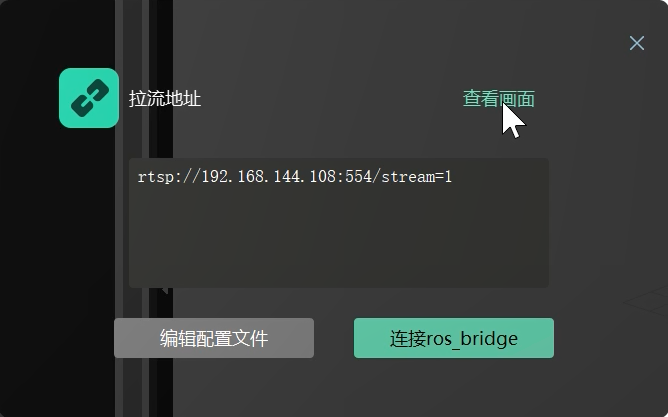
    
- 在弹出的对话框中，首先点击【查看画面】。
    
- 等待片刻，软件右下角的小窗口将显示摄像头捕捉的实时画面。
    
- 然后，点击对话框中的【连接ros_bridge】。
    
- 等待片刻，软件左上方将显示无人机的传感器信息，表明连接成功。
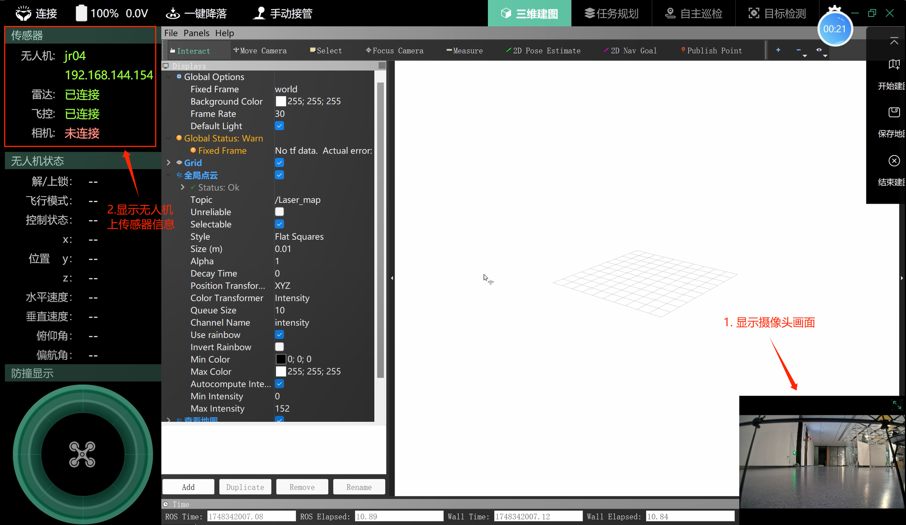
### 3.2 作业流程
本产品的作业流程遵循软件上方信息栏右侧所示的四个主要步骤：三维建图 → 任务规划 → 自主巡检 → 目标检测。


- **三维建图**：此功能将对当前环境进行整体三维建模，为后续任务提供地图参考。
    
- **任务规划**：此功能在已构建的三维地图上设置航迹点，并自动规划飞行路径。后续的自主巡检将依据这些航迹点和规划路径执行。
    
- **自主巡检**：此功能会将前两步生成的三维地图和航迹点数据发送至无人机。启动后，无人机将按照规划路径自动开始巡检飞行，并将飞行过程的视频存储到本地。
    
- **目标检测**：此功能采用AI目标识别算法，对巡检过程中存储的视频进行分析，以满足特定业务需求，并将检测结果保存到本地，用户可以通过软件查看。
    

接下来将详细介绍每个步骤的具体操作。
#### 3.2.1三维建图
**1.开始建图**

- 点击软件界面右侧的【开始建图】图标。
    
- 等待片刻，软件界面左侧将显示无人机状态数据，中间区域将显示雷达点云数据。
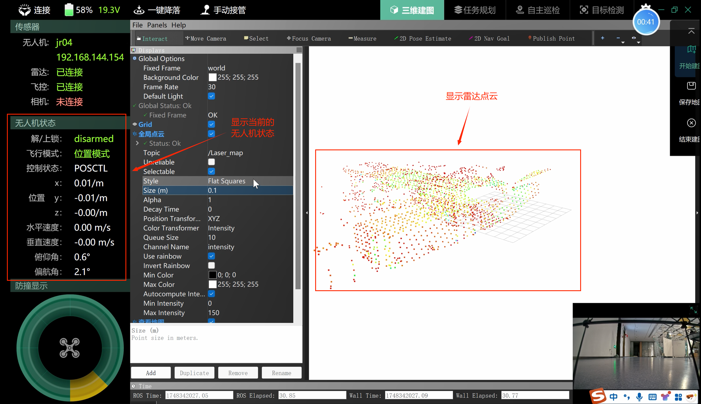
**2.执行建图**

- 手持无人机，沿需要建图的场景区域行走一圈，并返回起点。
    
- 完成后，观察雷达点云是否变得更加稠密，并确认其是否与实际场景接近。
    

**3.保存地图**

- 点击软件界面右侧的【保存地图】按钮，系统将弹出“保存设置”对话框。

    
- 在对话框中，确认“订阅话题”为`/Laser_map`。
    
- 用户可自主选择合适的“保存路径”来存储地图文件。
    
- 点击【确认】按钮完成保存。
    

**4.结束建图**

- 点击软件界面右侧的【结束建图】按钮。
    
- 等待片刻，软件界面左侧的无人机状态信息将变为空白或无消息状态，表示建图功能已关闭。
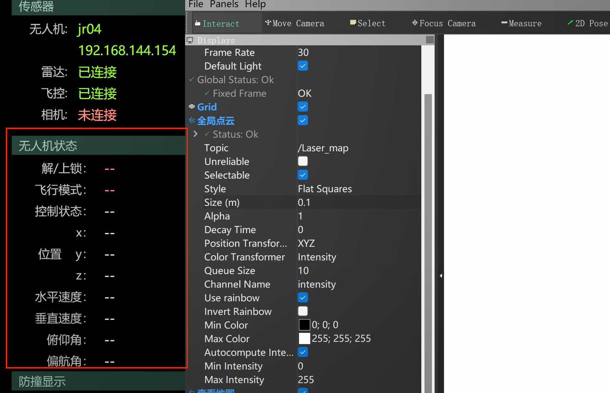

#### 3.2.2 任务规划
以下步骤以第一种选点方式为例进行说明。

**1.选择地图并启动打点程序**

- 点击软件界面右侧第一个【选择地图】按钮，系统将弹出“选择地图”对话框。
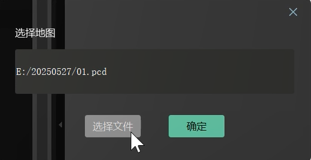
- 在对话框中，选择此前保存的地图文件（.pcd格式），然后点击【确认】。 此时，主界面中间区域应显示已加载的点云地图。
    
- 接着，点击软件界面右侧第二个【开始打点】按钮。
    
- 等待片刻，软件界面左侧将显示无人机状态信息。
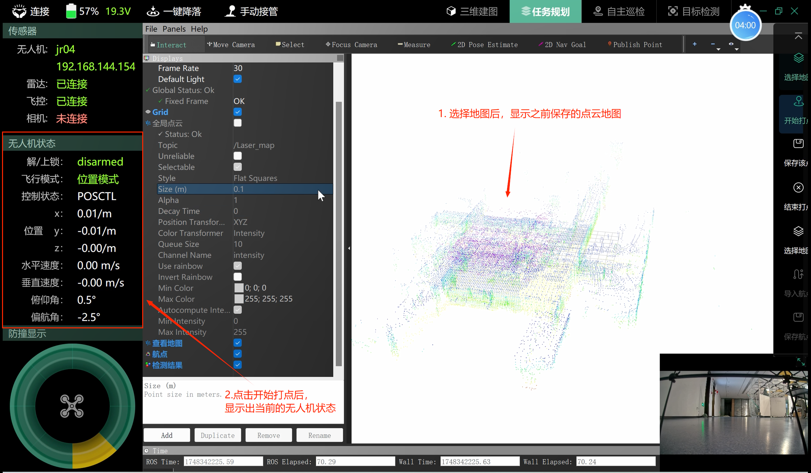

**2.航点标记 (打点)**

- 操作人员拿起无人机，沿着期望的巡检路径移动。
    
- 在每个关键位置（如拐点、长直线中点等），按下软件界面右侧第三个【保存该点】按钮以标记航点。
    
- 完成所有关键点的标记后，回到起点。
    

**3.结束打点**

- 完成所有航点标记后，点击软件界面右侧第四个【结束打点】按钮。
    
- 系统将自动弹出文件路径选择对话框，用户可自行选择存储路径与文件名（文件将以.xml格式保存）。
    
- 结束打点后，可以观察到软件界面左侧的无人机状态再次变为空白或无消息状态，表示打点程序已关闭。
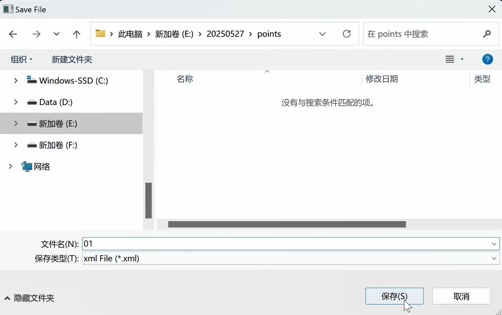

（第二种打点方式将在后续补充，当前教程不包含此部分内容。）

#### 3.2.3 自主巡检
**1.选择地图**

- 操作方式与“3.2.2 任务规划”章节中的“选择地图”步骤一致。
    

**2.选择轨迹**

- 参照选择地图的方式，选择在“3.2.2 任务规划”章节中结束打点时保存的XML轨迹文件。
    

**3.上传地图与轨迹**

此步骤的目的是将本地计算机中存储的地图数据和轨迹数据发送至无人机，以供无人机执行自主巡检任务。
    
- 点击软件界面右侧第三个【上传地图与轨迹】按钮。 此时，屏幕下方的任务栏会出现一个新的终端界面窗口。
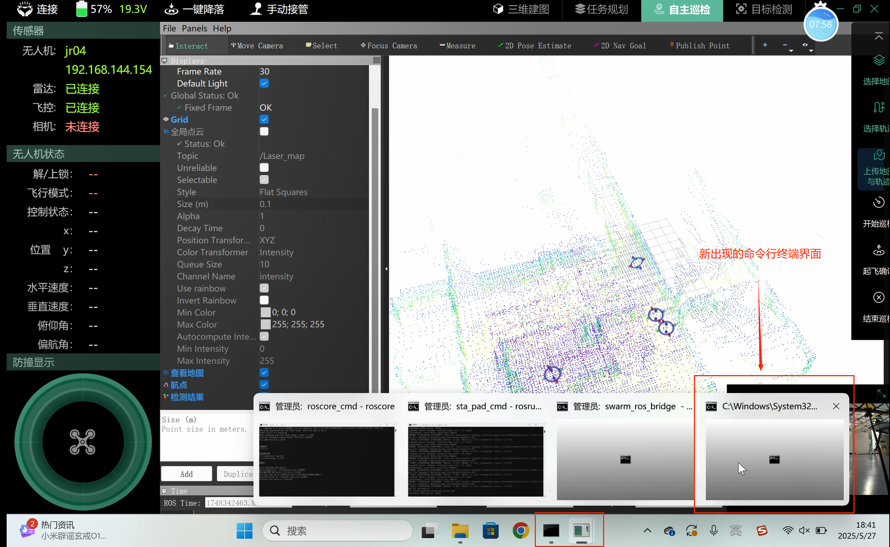
- 在新出现的终端界面中，按提示输入无人机密码（统一为111）。
    
- 观察进度显示，当两个进度条均达到100%时，表示数据发送成功。
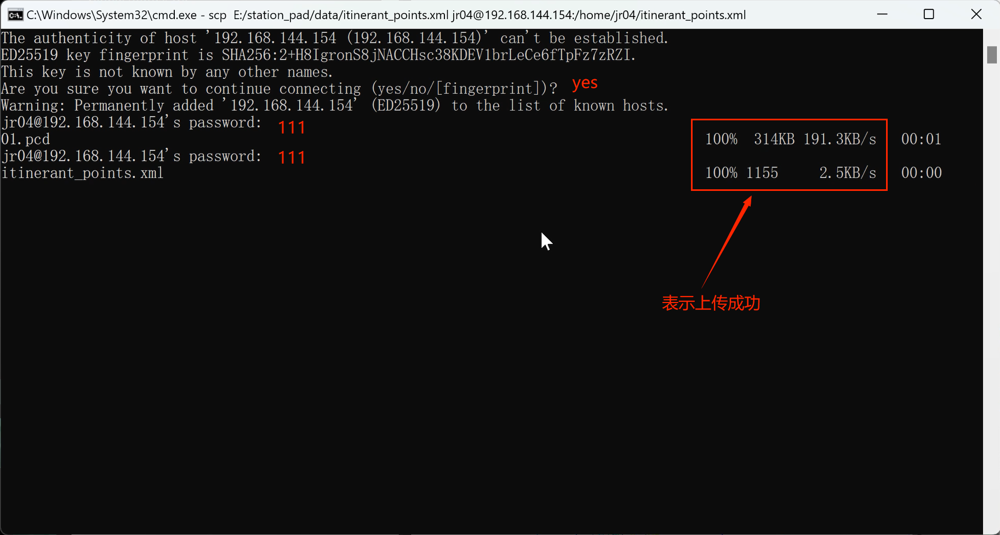

**4.开始巡检**

- 点击软件界面右侧第四个【开始巡检】按钮。系统将弹出文件路径选择对话框，用于选择巡检视频的保存路径。此视频将用于后续的目标检测。

- 选择好保存路径后，等待片刻。
    
- 软件界面左侧的无人机状态显示出数据，表示巡检程序已启动。
    

**5.起飞确认**

（注意：软件内的起飞确认功能目前尚在完善中，当前阶段请使用遥控器进行起飞确认。）
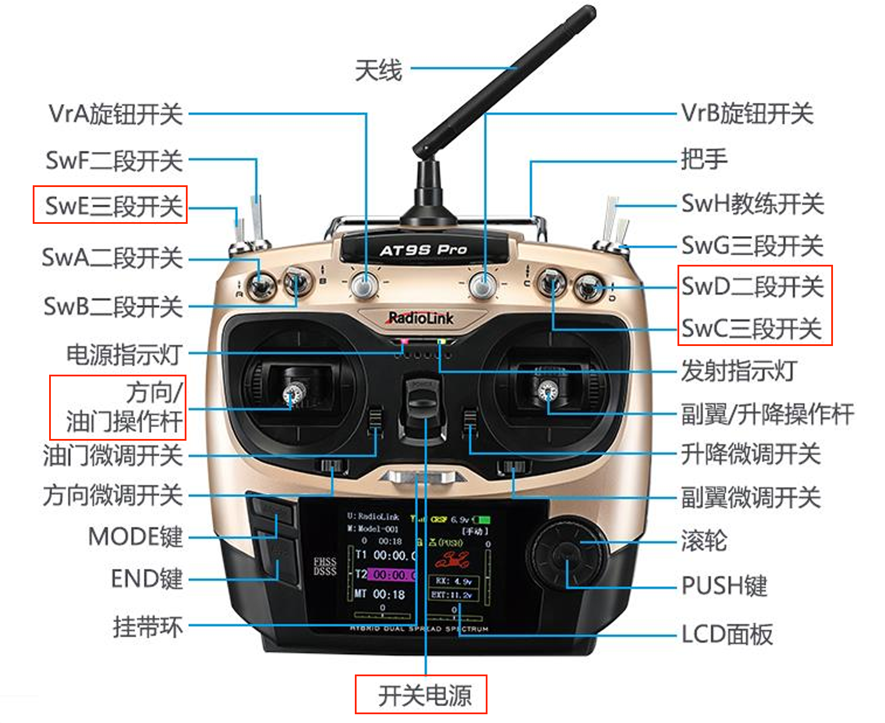

- **遥控器准备：**
    - 确保油门操作杆置于最低位置。
        
    - 将遥控器左上角的SwE三段开关拨至中间位置。
        
    - 将遥控器右上角的SwD二段开关和SwC三段开关均拨至最上方位置。
        
- **启动遥控器与连接：**
    - 使用开关电源打开遥控器。
        
    - 等待遥控器界面出现信号图标。
        
- **执行起飞确认：**
    - 将遥控器右侧的SwC三段开关拨至最下方，此时会听到无人机发出提示音。
        
    - 将遥控器左侧的SwE三段开关拨至最下方，完成起飞确认。
        
- **自主巡检过程：**
    - 完成起飞确认后，无人机将进入自动巡检模式，并沿规划路径飞行及录制视频。
        
    - 巡检任务结束后，无人机将自动返回至起点附近并平稳降落。
        
    - 待无人机停稳后，将遥控器上的SwD二段开关拨至最下方，表示停止飞行。
        

**6. 结束巡检**

- 点击软件界面右侧最后一个【结束巡检】按钮。
    
- 等待片刻，软件界面左侧的无人机状态将再次变为空白或无消息状态，表示巡检程序已结束。